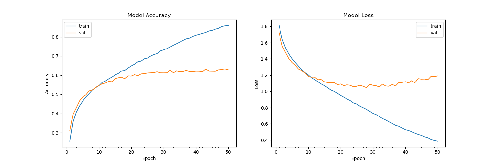

# Emotion Detection Lab

## Product Overview

Emotion Detection Lab is a computer-vision application that analyzes a visible facial expression and estimates one of seven classes: **Angry, Disgusted, Fearful, Happy, Neutral, Sad, or Surprised**.

The project combines a browser preview with a Python inference service. A user can start a webcam, capture one frame for analysis, or upload a JPG/PNG. The Haar cascade locates the face, then a convolutional neural network (CNN) returns expression probabilities for the interface, including a confidence readout and session graph.

Project work and the browser interface were developed by **Paaras Mishra**. This repository builds on the MIT-licensed emotion-detection implementation credited in [LICENSE](LICENSE).

## The Problem

Facial-expression experiments are difficult to inspect in real time. A command-line script may return a label, but it does not show confidence, track deliberate captures, or provide a practical way to adapt the model to a new person.

Common causes of unreliable results include:

- Poor lighting, extreme angles, occlusion, or a face that is too far from the camera.
- Limited or imbalanced training examples for a person's expressions.
- Confusing model confidence with actual accuracy.
- Continuous webcam predictions that fluctuate from frame to frame without producing a stable, reviewable sample.

## The Solution

This project provides a capture-based workflow:

1. The browser requests a webcam frame only when the user selects **Capture & analyze**.
2. The Python service decodes the frame and uses a Haar cascade to find the largest face.
3. The face is converted to grayscale and resized to the CNN's expected 48x48 input.
4. The CNN produces probabilities for all seven expression classes.
5. The interface displays the strongest prediction, confidence, class distribution, recent readings, and a session graph.
6. A separate command-line collector creates balanced, person-specific training data without saving images through the website.

Each plotted point is an intentional capture rather than an untracked fluctuation from a continuous stream.

## Main Features

- Webcam face detection with OpenCV Haar cascade.
- One-capture-at-a-time CNN analysis.
- JPG and PNG upload analysis.
- Seven-class probability distribution.
- Confidence meter, history list, and emotion-over-time plot.
- Light and dark interface themes.
- Separate personal-data collector with labeled expression folders.
- Personal CNN fine-tuning with configurable epochs and validation checkpoints.

## Use Cases

- Learning how face detection and CNN classification work together.
- Demonstrating a computer-vision pipeline in a classroom or portfolio project.
- Testing how a model responds to deliberate expression changes.
- Prototyping an interface for human-computer interaction research.
- Fine-tuning a model for one person's expression style using labeled images.

This is an expression-classification prototype, not a reliable measurement of a person's internal emotional state. Predictions should not be used for medical, employment, disciplinary, or other high-impact decisions.

## Dependencies and Setup

* Python 3.12, [OpenCV](https://opencv.org/), [TensorFlow](https://www.tensorflow.org/), [Flask](https://flask.palletsprojects.com/), and [Matplotlib](https://matplotlib.org/)
* To install the required packages, run `pip install -r requirements.txt`.

Clone the repository and enter the folder:

```bash
git clone https://github.com/PaarasMishra2114/EmotionDetectionMAIN.git
cd EmotionDetectionMAIN
C:\emotion-venv\Scripts\python.exe -m pip install -r requirements.txt
```

## Basic Usage

Start the browser preview and CNN API:

```bash
C:\emotion-venv\Scripts\python.exe server.py
```

Open `http://127.0.0.1:8000`, start the camera, and choose **Capture & analyze**. You can also upload a JPG or PNG. The website analyzes images but does not collect or save training data.

* Download the FER-2013 dataset inside the `src` folder.

To use the original FER-2013 training workflow:

```bash
cd src
python emotions.py --mode train
```

To run the standalone webcam detector:

```bash
cd src
python emotions.py --mode display
```

* The folder structure is of the form:  
  src:
  * data (folder)
  * `emotions.py` (file)
  * `haarcascade_frontalface_default.xml` (file)
  * `model.h5` (file)

* This implementation by default detects emotions on all faces in the webcam feed. With a simple 4-layer CNN, the test accuracy reached 63.2% in 50 epochs.



## Data Preparation (optional)

* The [original FER2013 dataset in Kaggle](https://www.kaggle.com/deadskull7/fer2013) is available as a single csv file. I had converted into a dataset of images in the PNG format for training/testing.

* In case you are looking to experiment with new datasets, you may have to deal with data in the csv format. I have provided the code I wrote for data preprocessing in the `dataset_prepare.py` file which can be used for reference.

## Browser preview and personal fine-tuning

Start the browser UI and CNN API with:

```bash
C:\emotion-venv\Scripts\python.exe server.py
```

Open `http://localhost:8000`, start the camera, then use **Capture & analyze**. You can also upload a JPG or PNG; the Haar cascade finds the largest face and the CNN returns all seven class probabilities for the plot. The website does not collect or save training data.

To collect personal training data separately, run:

```bash
C:\emotion-venv\Scripts\python.exe collect_personal_data.py --person me --per-expression 110
```

The collector opens a webcam window and guides you through Angry, Disgusted, Fearful, Happy, Neutral, Sad, and Surprised. Make the selected expression, press **Space** to save a labeled face photo, press **N** to skip an expression, or press **Q** to quit. It saves to `data/personal/me/<expression>/` and resumes existing counts.

For person-specific fine-tuning, the collector creates this labeled structure:

```text
data/personal/alex/Angry
data/personal/alex/Disgusted
data/personal/alex/Fearful
data/personal/alex/Happy
data/personal/alex/Neutral
data/personal/alex/Sad
data/personal/alex/Surprised
```

Then run, for example, `C:\emotion-venv\Scripts\python.exe train_personal.py --person alex --epochs 30`. Keep a separate backup of `src/model.h5`; fine-tuning replaces it with the best validation checkpoint. More labeled, varied images per expression generally improve results more than simply increasing epochs.

## Algorithm

* First, the **haar cascade** method is used to detect faces in each frame of the webcam feed.

* The region of image containing the face is resized to **48x48** and is passed as input to the CNN.

* The network outputs a list of **softmax scores** for the seven classes of emotions.

* The emotion with maximum score is displayed on the screen.

## References

* "Challenges in Representation Learning: A report on three machine learning contests." I Goodfellow, D Erhan, PL Carrier, A Courville, M Mirza, B
   Hamner, W Cukierski, Y Tang, DH Lee, Y Zhou, C Ramaiah, F Feng, R Li,  
   X Wang, D Athanasakis, J Shawe-Taylor, M Milakov, J Park, R Ionescu,
   M Popescu, C Grozea, J Bergstra, J Xie, L Romaszko, B Xu, Z Chuang, and
   Y. Bengio. arXiv 2013.
